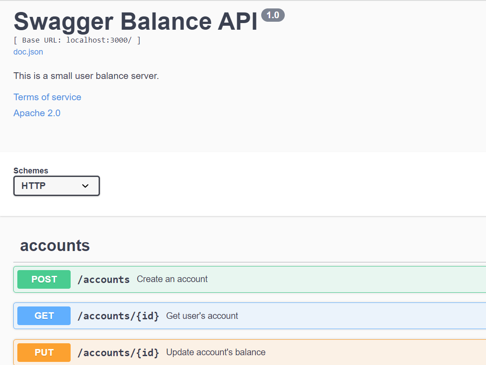

# Simple user-balance service

## Launch service

Just use `docker-compose up` command. Service is available on port 3000.

You can also use swagger and try work with API throuh it.
`Swagger` is available  on address: `http://localhost:3000/swagger/index.html`

You can also use `Adminer` - it helps you check entities in database.
Adminer is available on address `http://localhost:8080`

## Available routes

### POST /accounts - create account

input params: owner - name of user (required), balance - positive numeric value

### GET /account/:id - get account

input params: id - integer value

### PUT /account/:id - update account 

input params: id - integer value, amount - amount of money you want to plus/minus from balance 

### POST /report - create month report

input params: date - provided as YYYY-MM-DD. You can choose DD whatever you want (report based on year and month)

You can't download csv file with docker-container, so I print values as report key in response.
Csv file is created inside container, you can easily find it.

### PUT /transfers - update transfer status

input params: transaction_id - id of existed transaction which has "PENDING" status. Status(enum: Success | Failed) - status to update.

### POST /transfers - create transfer 

input params: service_id  - you can only buy products (service_id = 1). Products - array of objects(amount, productId). Amount should be positive value.

## Launch service

### Folders

`api` - here you can find endpoints

`db` - database folder.

----`migration` - schemas to create/delete table

----`query` - actual SQL code. I use SQLC to generate golang code.

----`sqlc` - here you can find boilerplate code and tests

--------`store` - here you can find tx implemenation

--------`store_test` - tx tests

----`docs` - here you can find swagger code and actual schemas of tables in PDF format

----`reports` - folder for reports

----`utils` - some helper functions
